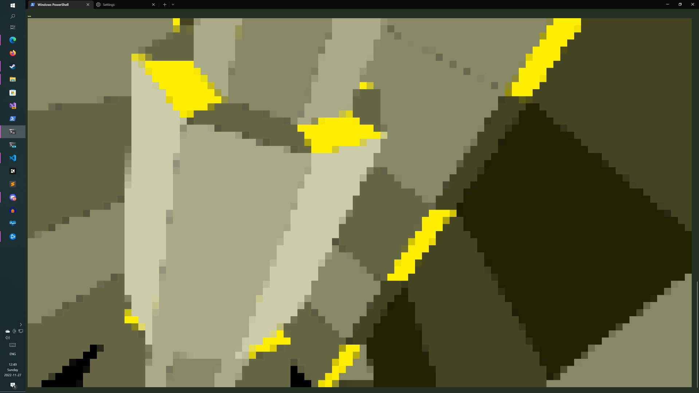
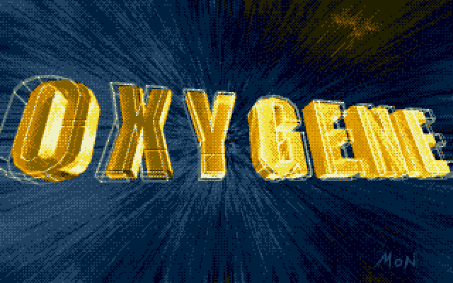
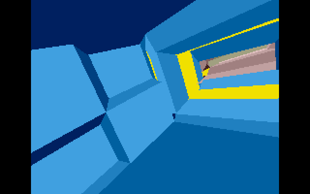
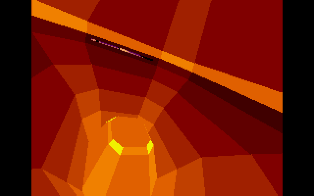
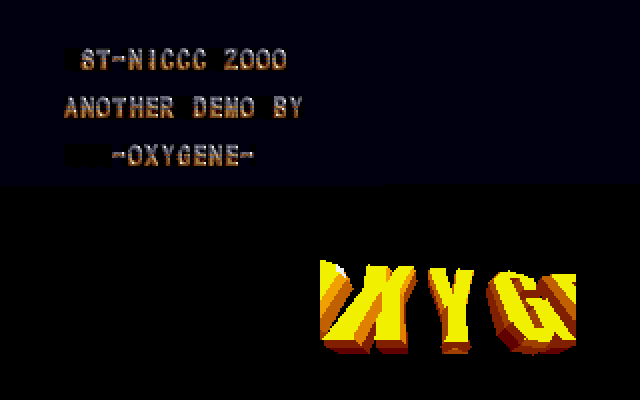

# Recreating ST-NICC 2000 1st place demo in F#

## TLDR; parses a polygon file format for an Atari STE demo released in 2000


[F#-NICC recording, turn on the sound](https://www.instagram.com/p/Cj1Fb2ZAwcK/)

### Build and run

```bash
# In a terminal window
cd source/FsNICC.Spectre
dotnet run -c Release
```



ST-NICC aka "ST News International Christmas Coding Convention" had a demo competition in 2000, the [winner](https://www.youtube.com/watch?v=nqVJWFNpTqA) was [Oxygene](https://demozoo.org/groups/2118/) with an amazing 3D screen for Atari STE.




I did play a small part in providing the PRO tracker player.

I much later found out that there was competition in 2019 to port the Oxygene demo on different platforms.

There are some amazing ones for:

* [Amiga](https://www.youtube.com/watch?v=7sYhIxiizKY)
* [Atari STF](https://www.youtube.com/watch?v=8VOCbmMMteY)
* [SNES](https://www.youtube.com/watch?v=dOqxLBZiBRA)([No SuperFX](https://www.youtube.com/watch?v=BQE1rr1Xqf0))
* [Atari 800XL](https://www.youtube.com/watch?v=rVa0ZEdwqoY)
* [BBC Micro](https://www.youtube.com/watch?v=_mVI9d2Acyw)([source](https://github.com/kieranhj/stnicc-beeb/tree/master/data))

## F# advent 2022

I sometimes write for [F# advent](https://sergeytihon.com/2022/10/28/f-advent-calendar-in-english-2022/), usually about things that have no use to anyone but perhaps interesting to a few people out there.

I was thinking, could I recreate the ST-NICC winner in F# for F# advent?

From the competition invite to port the demo there was a format description as well as the original data file.

So in theory I could do it.

## Parsing a 20 year old binary format

Because CPUs were a bit more limited on the old Atari STE than today [Leonard](https://demozoo.org/sceners/2527/) had precomputed all the coordinate transforms for the entire 3D scene and stored them in a compact binary format, around 600KiB. As the most common Atari STE had 1024KiB of memory that didn't leave much memory for other things like my memory hungry PRO Tracker player.

So [Leonard](https://demozoo.org/sceners/2527/) streamed the data from disk into memory on-demand while the demo was running.

In order to recreate the ST-NICC winner we need to parse the binary format

### The format

See the [FORMAT.md](FORMAT.md) for all the details but:

1. The entire scene is composed of 1,800 frames.
2. A frame has a flag to indicate if the screen needs clearing, a palette delta and the polygons
3. A polygon is either indexed (to save space) or non-indexed
4. If non-indexed polygons has palette index and vertices
5. If indexed polygons starts with all vertices then palette index and indexes to the vertices

This can in F# be represented like this:

```fsharp
// Atari STE used RGB colors but only had 4096
//  Only the low nibble in each byte used
type [<Struct>] RGB         =
  {
    Red     : byte
    Green   : byte
    Blue    : byte
  }
// The vertices were 2 bytes, meaning the 3D
//  model didn't utilize the full 320x200 resolution of the screen
//  but was limited to 256x200
type [<Struct>] Vertex2D    =
  {
    X   : byte
    Y   : byte
  }
// The index of the color in the palette
type [<Struct>] ColorIndex  =
  {
    Index   : byte
  }
// The palette of Atari STE was 16 colors
//  The first (0) being the background color
type [<Struct>] PaletteItem =
  {
    ColorIndex  : ColorIndex
    Color       : RGB
  }
// The polygon has an index to the color to use
//  and the vertices
//  While the model has an indexed mode as well
//  when parsing I converted to non-indexed as
//  a Win10 machine don't struggle with a few extra KiBs.
type [<Struct>] Polygon     =
  {
    ColorIndex  : ColorIndex
    Vertices    : Vertex2D array
  }
// The frame
//  ClearScreen is used to tell if we should clear screen
//    between frames. Clearing screen takes time so why do it if
//    it's not needed?
//  PaletteDelta is an array of 0..16 elements
//    It's used to update the current palette of 16 colors
//    Just overwrite the color at the index of the palette item
//  Polygons is an array of polygons for the frame
type [<Struct>] Frame =
  {
    ClearScreen   : bool
    PaletteDelta  : PaletteItem array
    Polygons      : Polygon array
  }
// The entire scene is just all frames
type [<Struct>] Scene =
  {
    Frames        : Frame array
  }
```

Once parsed we "just" render frame by frame to recreate the ST-NICC winner.

### The parser

I thought a binary parser combinator makes sense, like so:

```fsharp
// A 'T BinaryReader takes a byte array and an index as input.
//  It computes a value of 'T and returns it plus the updated index
type 'T BinaryReader = byte array -> int -> struct ('T*int)
```

When parsing text files it's common to return an option or something similar as it's common in text parsers to attempt different parsers to find that one that matches. Binary parsers tend to be more read a value that tells you what the following bytes represent, pick the correct parser and parse the bytes. If the input is incorrect we just throw and stop the entire parsing process.

The format consists of either byte or word (2 bytes) values so we need parsers for thus:

```fsharp
  let inline bbyte () : uint8 BinaryReader = fun bs i ->
    struct (bs.[i], i + 1)

  let inline bword () : uint16 BinaryReader = fun bs i ->
    // Atari STE uses Motorola 68000 CPU which stores number in big-endian
    let word =
        ((uint16 bs.[i]) <<< 8)
      + (uint16 bs.[i +  1])
    struct (word, i + 2)
```

To this I added the computation expression builder:

```fsharp
  type BinaryReaderBuilder () =
    class
      member inline x.Bind  ( [<InlineIfLambda>] t  : _ BinaryReader
                            , [<InlineIfLambda>] uf : _ -> _ BinaryReader
                            ) : _ BinaryReader = fun bs i ->
        let struct (tv, ti) = t bs i
        uf tv bs ti

      member inline x.Combine ( [<InlineIfLambda>] t : _ BinaryReader
                              , [<InlineIfLambda>] u : _ BinaryReader
                              ) : _ BinaryReader =  fun bs i ->
        let struct (_, ti) = t bs i
        u bs ti

      member inline x.MergeSources  ( [<InlineIfLambda>] t : _ BinaryReader
                                    , [<InlineIfLambda>] u : _ BinaryReader
                                    ) : _ BinaryReader =  fun bs i ->
        let struct (tv, ti) = t bs i
        let struct (uv, ui) = u bs ti
        struct (struct (tv, uv), ui)

      member inline x.BindReturn    ( [<InlineIfLambda>] t : _ BinaryReader
                                    , [<InlineIfLambda>] f
                                    ) : _ BinaryReader =  fun bs i ->
        let struct (tv, ti) = t bs i
        struct (f tv, ti)

      member inline x.Return  ( v : 'T
                              ) : 'T BinaryReader =
        bvalue v
      member inline x.ReturnFrom  (br : 'T BinaryReader
                                  ): 'T BinaryReader =
        br
    end
  let breader = BinaryReaderBuilder()
```

My hope by making the functions inline and `[<InlineIfLambda>]` is to reduce overhead from the parser combinator. The problem I found was that it didn't really help for `Bind` that much but at least it improved it in those cases where applicatives could be used (`MergeSources` and `BindReturn`).

### Parsing Atari STE RGB colors

The RGB color is a 16bit word that looks something like this: `0x0FA3`. The last 3 nibbles represent RGB. On Atari STE the full nibble was used given access to `16*16*16 => 4096` colors. The Atari STE was backwards compatible with Atari ST that had just 512 colors available (only 3 out of 4 bits was used in each nibble).

Thus `0x0777` on Atari ST was full white, on the Atari STE `0x0FFF` was full white. In order to be backwards compatible `0x0777` on Atari STE should be close to full white. Because of that bit 3 in each nibble is actually bit 0 and bit 0-2 are shifted left 1 step.

This will complicate stuff for us 20+ year later.

```fsharp
  let inline brgb () =
    breader {
      // Helper function to process a nibble
      let inline cp c i =
        let c = int c
        // Extract nibble at bit pos i
        let cp    = (c >>> i) &&& 0xF
        // Atari ST color
        // Left shift lowest 3 bits 1 step ie multiply by 2
        let c     = (cp &&& 0x7) <<< 1
        // Atari STE extended color
        // Extract bit 3 and downshift it to bit0, add it to Atari ST color bits
        let c     = c + ((cp >>> 3) &&& 0x1)
        byte c

      // Read the 16 bit color word
      let! c = bword ()
      return { Red = cp c 8; Green = cp c 4; Blue = cp c 0 }
    }
```

The Atari STE had a 16 color palette. Each frame has an optional palette delta. The palette delta starts with a 16 bit mask telling us what entries in the palette should be updated and following are RGB color values for each bit set to 1 in the mask.

```fsharp
  let bpaletteDelta : PaletteItem array BinaryReader =
    breader {
      // Read the 16 bit bitmask which palette items are to be updated.
      let! bitmask  = bword ()
      let bitmask   = uint32 bitmask
      // Count the number of bits in the bitmask.
      let bitCount  = popCount bitmask |> int
      // brepeat is a parser primitive that let's us repeat any
      // parser n times and return the result as an array
      let! rgbs     = brepeat bitCount (brgb ())
      let pds       = Array.zeroCreate bitCount
      // Zip the bit selection with the rgb values
      let rec loop bitmask i j (rgbs : _ array) (pds : _ array)=
        // Bitmask is 0 we are done
        if bitmask <> 0u then
          let i =
            if (bitmask &&& 0x8000u) <> 0u then
              // Highest bit is 1 indicating we should update the current paltte index (j) with current color (i)
              pds.[i] <- { ColorIndex = { Index = j }; Color = rgbs.[i] }
              i + 1
            else
              // Otherwise skip
              i
          // Shift mask to left to process next bit
          loop (bitmask <<< 1) i (j + 1uy) rgbs pds
      loop bitmask 0 0uy rgbs pds
      return pds
    }
```

This delta will then be used when updating the palette when we are rendering frame.

### A sense of failure in abstraction

While I got the parser working in the end I feel that I haven't found the right abstractions. My main problem was that while parsing the polygons they are each prefixed with a value that either says that following bytes are a polygon or the frame is complete and even if we should jump to the next 64KiB page in the file.

I suppose the reason for the 64KiB pages in the file is because of the original demo streaming from disk. I think it uses two 64KiB buffers. One buffer is being rendered and the other is being populated from disk. When the demo reaches flip page command it renders the other buffer and the first buffer is populated from disk.

But that polygon parse result modifies how the frame parser should behave, which complicated it for me.

The polygon parser looks like this:
```fsharp
  let bpolygon =
    // brepeatPrefix repeats a parser depending on the prefix
    // The prefix either say read next value or exit the loop
    brepeatPrefixed
      (bpolygonDescriptor ())
      (fun (ci, vc) ->
        breader {
          let! vs = bvertices (int vc)
          return polygon ci vs
        }
      )
```

Above doesn't look too bad but I feel the signature of the `brepeatPrefixed` is too obscure:

```fsharp
  // Continue means continue to apply the parser with the seed value 'S
  // Stop means stop parsing and transform accumulated value 'T to 'U
  type PrefixResult<'S, 'T, 'U> =
    | Continue  of  'S
    | Stop      of  ('T -> 'U)

  let inline brepeatPrefixed
    // Prefix parser
    ([<InlineIfLambda>] t   : PrefixResult<'S, 'T array, 'U> BinaryReader )
    // Value parser accepting a seed value of 'S producing 'T
    ([<InlineIfLambda>] uf  : 'S -> 'T BinaryReader                       )
    : 'U BinaryReader = fun bs i ->
```

I feel it is too clunky and not generic enough.

The first parser `t` parses the prefix and returns either a `Continue` value with a seed value given to the second parameter (for example how many vertices should be read for the following polygon). If we are done it returns a `Stop` value with a function that transforms the accumulated value (a polygon array for example) into the final parser value. This is to allow the prefix parser to send one of three variants to the frame parser, read Next frame, flip page and read Next frame or Stop.

```fsharp
  // Ready the polygon descriptor prefix
  let bpolygonDescriptor () =
    breader {
      let! pd = bbyte ()
      return
        match pd with
        // 3 special cases of polygon descriptors that stops
        //  reading polygons
        | 0xFFuy  -> Stop Next
        | 0xFEuy  -> Stop NextPage
        | 0xFDuy  -> Stop Done
        | _       ->
          // Extract polygon color index
          let ci = (pd >>> 4) &&& 0xFuy
          // Extract number of vertices in the polygon
          let vc = pd &&& 0xFuy
          // Read following bytes as a polygon
          Continue ({ Index = ci }, vc)
    }
```

If someone has some ideas on how to make it less clunky and/or increase the generality of the abstraction I would love to hear it.

## Rendering ST-NICC in 2022

To give the proper retro feeling I felt it to be a great idea to render the entire thing in the terminal.

Printing to the terminal can be slow and colors are not portable. Luckily there are portable and libraries like [Terminal.GUI](https://github.com/gui-cs/Terminal.Gui) and [Spectre.Console](https://github.com/spectreconsole/spectre.console).

### Spectre.Console
I went with [Spectre.Console](https://github.com/spectreconsole/spectre.console) as I used it to render 2D particle constraints systems in the terminal before.

Setting up a 2D canvas (a ridiculously entertaining idea) in the terminal is very easy with [Spectre.Console](https://github.com/spectreconsole/spectre.console).

```fsharp
  // The dimensions of the Atari STE graphics area in ST-NICC
  let w = 256
  let h = 200

  let canvas = Canvas (w, h)
  let updater (ctx : LiveDisplayContext) =
      // Red color
      let red = Spectre.Console.Color (255uy, 0uy, 0uy)
      for i = 0 to 199 do
        // Draw a line of red pixels
        canvas.SetPixel(i, i, red) |> ignore
        // Refresh screen between each pixel drawn
        ctx.Refresh()
  AnsiConsole.Live(canvas).Start(updater)
```

### Drawing polygons with ImageSharp

As great as [Spectre.Console](https://github.com/spectreconsole/spectre.console) is [Spectre.Console](https://github.com/spectreconsole/spectre.console) doesn't support drawing polygons and a polygon filler function is a pain to implement. I know, I tried and failed to implement one for the old Atari STE.

Instead, I lifted in [SixLabors.ImageSharp](https://github.com/SixLabors/ImageSharp). As my work here is licensed under Apache License V2 I can choose that option when picking license under [SixLabors.ImageSharp](https://github.com/SixLabors/ImageSharp) split license.

This makes the updater function for the terminal straight forward:

```fsharp
  let updater (ctx : LiveDisplayContext) =
    // Create an RGB image matching the Canvas width and height
    use image = new Image<Rgb24> (w, h)
    // Draw each frame
    for frame = 0 to sscene.Frames.Length - 1 do
      // Mutator function
      let filler (ctx : IImageProcessingContext) =
        let f = sscene.Frames.[frame]
        // Some frames rely on the previous frame not being cleared to look right
        if f.ClearScreen then
          ctx.Clear (Color ()) |> ignore
        // Draw each polygon
        for p in f.Polygons do
          ctx.FillPolygon (p.Fill, p.Points) |> ignore
      image.Mutate filler

      for y = 0 to h - 1 do
        for x = 0 to w - 1 do
          // Grab an image pixel
          let c = image[x, y]
          // Convert to Spectre color
          let sc = Spectre.Console.Color (c.R, c.G, c.B)
          // Draw it in the Spectre canvas
          canvas.SetPixel(x, y, sc) |> ignore
      ctx.Refresh()
```

The frames however are not the same model as produced by the scene parser. Instead, the preprocessing step converts it into a specialized model to fit rendering with Spectre + ImageSharp.

```fsharp

// Everything precomputed so we just can render the polygon with ImageSharp
type [<Struct>] SpectrePolygon =
  {
    Fill        : Color
    Points      : PointF array
  }

// Dropped the palette delta as the actual color is now part of the polygon
type [<Struct>] SpectreFrame =
  {
    ClearScreen : bool
    Polygons    : SpectrePolygon array
  }

type [<Struct>] SpectreScene =
  {
    Frames      : SpectreFrame array
  }

let toSpectreScene (scene : Scene) : SpectreScene =
  // Maps from parsed RGB to ImageSharp Color
  let inline toColor (rgb : RGB) =
    let inline convert c = (c <<< 4) + c
    Color.FromRgb (convert rgb.Red, convert rgb.Green, convert rgb.Blue)

  // Atari STE had 16 color palette, all of them black to begin with
  let palette = Array.zeroCreate 16

  let mapPolygon (polygon : Polygon) : SpectrePolygon =
    // Map the parsed byte*byte vertices to float32*float32 vertices
    let points =
      polygon.Vertices
      |> Array.map (fun v -> PointF (float32 v.X, float32 v.Y))
    {
      // Lookup the color in the current palette
      Fill    = palette.[int polygon.ColorIndex.Index]
      Points  = points
    }

  let mapFrame (frame : Frame) : SpectreFrame =
    // Updates the palette from the palette delta
    for pi in frame.PaletteDelta do
      palette.[int pi.ColorIndex.Index] <- toColor pi.Color
    let polygons =
      frame.Polygons
      |> Array.map mapPolygon
    {
      ClearScreen = frame.ClearScreen
      Polygons    = polygons
    }

  let frames =
    scene.Frames
    |> Array.map mapFrame

  { Frames = frames }
```

With that we are done and can observe the silliness by running the program in a terminal

```bash
# In a terminal window
cd source/FsNICC.Spectre
dotnet run -c Release
```


*Merry christmas!*

## Appendix 0 - Rendering STNICC in WPF

For Windows users wanting "high fidelity" graphics there is also provided a WPF project that uses the same input to render STNICC in WPF.

```bash
# Only works on Windows
cd source/FsNICC.WPF
dotnet run -c Release
```


Works along similar principles as the [Spectre.Console](https://github.com/spectreconsole/spectre.console) example.

However, F# is a bit WPF resistant so for a C# developer used to WPF it might look odd but that is because XAML isn't support for F# AFAIK.

A challenge with WPF is how to trigger a redraw of the screen at 60FPS. I never really found a brilliant way to do it so I rely on WPF animations that I use to trigger an invalidate of the visual and then I render the STNICC polygons in `OnRender`.

```fsharp
type SceneElement (scene : WPFScene) =
  class
    inherit UIElement ()

    // Setup the dependency property descriptor for the Time property,
    //  this dependency property we will animate and on each change the visual
    //  will be invalidated
    static let timeProperty =
      let pc = PropertyChangedCallback SceneElement.TimePropertyChanged
      let md = PropertyMetadata (0., pc)
      DependencyProperty.Register ("Time", typeof<float>, typeof<SceneElement>, md)

    // Invalidates the visual
    static member TimePropertyChanged (d : DependencyObject) (e : DependencyPropertyChangedEventArgs) =
      let g = d :?> SceneElement
      g.InvalidateVisual ()

    static member TimeProperty = timeProperty

    member x.Time = x.GetValue SceneElement.TimeProperty :?> float

    // Starts the animation for the the Time property
    member x.Start () =
      let b   = 0.
      let e   = 1E9
      let dur = Duration (TimeSpan.FromSeconds (e - b))
      let ani = DoubleAnimation (b, e, dur) |> freeze
      x.BeginAnimation (SceneElement.TimeProperty, ani);

    override x.OnRender dc =
      let time  = x.Time
      // Render Stuff!
      ()
```
## Appendix 1 - Debugging and testing the parser

Even if I think the binary parser combinators help writing a correct parser it is still bit-fiddling and very easy to screw up.

So early on in the process I built functions to write the parsed model into an intended text stream.

This text stream is committed to git: `assets/scene1.txt`

This helped me alot during the initial parsing so that I could have an easy text format to see if the parsed values I produced made sense.

But it still provides value for me when I do refactorings to the code, for example optimizations or extending it with functionality to split complex polygons into simple ones.

After the refactoring I regenerate the text file and make sure that the model changes only contain the expected changes.

A neat little trick I think for when one are implementing parsers where you like to check the parser model in its entirety after refactoring yet want to make easy to establish a new baseline after determining the refactoring produced the right changes to the model (commit the updated text file).

I wrote a little indented streamer writer combinator library.  I found the library surprisingly slow but at least it produces the right result :).

I suppose I should debug it in depth to find the bottleneck someday.

## Appendix 2 - My contribution to STNICC 2000
As mentioned I made a small contribution to STNICC by providing the PRO tracker player.

If anyone is interested in arcane Atari topic I wrote up a blog explaining the history for the [PRO tracker player](https://github.com/mrange/pt_src3).

## Appendix 3 - Portable fast bit population count.

An interesting problem is how to count the number of bits in a word effectively. For this parser performance it's not a problem but a fast bit counter is so wonderfully opaque and obscure I just had to include it.

Trivially one writes a loop that checks if the lowest bit is set, increments a counter if set and then shifts the word right 1 step.

Trivial but boring so instead one can do this:

```fsharp
  let popCount (i : uint32) : uint32 =
    // From: http://graphics.stanford.edu/~seander/bithacks.html#CountBitsSetParallel
    let mutable v = i
    v <- v - ((v >>> 1) &&& 0x55555555u)
    v <- (v &&& 0x33333333u) + ((v >>> 2) &&& 0x33333333u)
    ((v + (v >>> 4) &&& 0xF0F0F0Fu) * 0x1010101u) >>> 24
```

Wonderful, just wonderful. I really recommend the [bithacks](http://graphics.stanford.edu/~seander/bithacks.html) site.

If we know a program always executes on x86 we could use the [x86 intrinsics](https://learn.microsoft.com/en-us/dotnet/api/system.runtime.intrinsics.x86.popcnt.popcount?view=net-7.0#system-runtime-intrinsics-x86-popcnt-popcount(system-uint32)) to count bits as this is supported by all x86 CPUs.

## Appendix 4 - Unfinished work

To support modern hardware we should triangulate the polygons.

Triangulating simple polygons (no intersections) are reasonable easy thanks to the two ears theorem. The problem is the ST-NICC triangles are not all of them simple.

So I spent a lot of time identifying if a polygon is not simple (if lines are intersecting) and then split them.

In the end I ran out of energy before the deadline for the blog post and abandoned the work before I finished the triangulation algorithm.

You find traces of the effort from this in the scene parser to detect convexity, simples and splitting complex polygons into simple ones.

## Appendix 5 - What is a 'nibble'?

I was asked by my buddy [Thindal](https://www.twitch.tv/thindal): What is a nibble? He figured it out by himself but it's not common knowledge.

A nibble is a 4-bit number that can hold values 0-15. The nibble was the word sized used in the 1971 legendary CPU [Intel 4004](https://en.wikipedia.org/wiki/Intel_4004). Later CPUs introduced byte (8-bit) as the word size and while modern CPUs uses much bigger word size we still talk about bytes while nibbles are largely forgotten.

